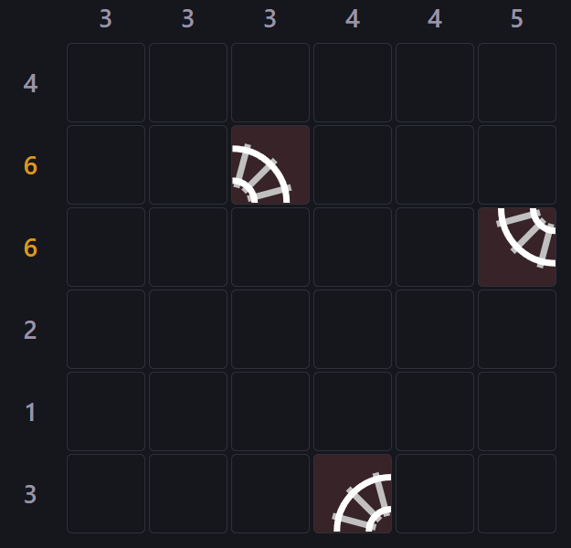
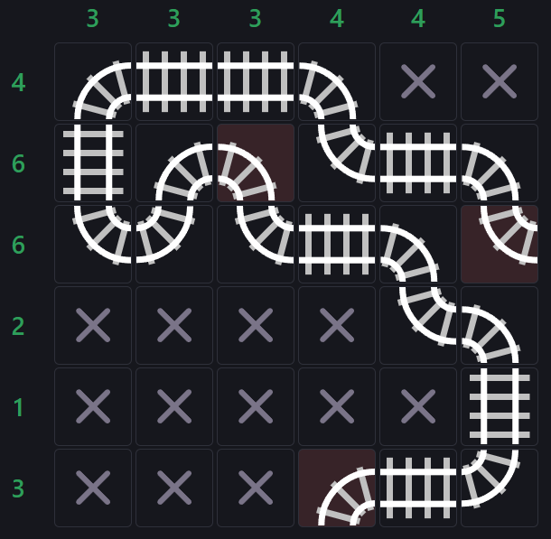
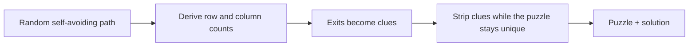

# Train Tracks

A [Tracks](https://en.wikipedia.org/wiki/Tracks_(puzzle))-style logic puzzle:
draw a single continuous railway that satisfies the row and column counts, with
exactly two track segments leading off the grid. Includes daily puzzles, a
practice mode, and a from-scratch puzzle generator and solver.

**Play it: <https://traintracks.therestinmotion.com/>**

| Unsolved | Solved |
| --- | --- |
|  |  |

## Features

- **Daily puzzle** in three sizes — 6x6 Easy, 7x7 Medium, 9x9 Hard — seeded
  deterministically from the date, so everyone gets the same puzzle on a day.
- **Calendar** for revisiting past days, with a checkmark per size you solved.
- **Practice mode** with the same three sizes and unlimited fresh puzzles.
- **Undo**: `Z`, or the toolbar button. One undo step reverts a whole stroke,
  including a drag.
- **Keyboard tools**: `D` selects the dot tool, `X` selects the X tool.
- **Live row/column hints**: green when a count is met, red when it is exceeded,
  red when the X-marks make the count impossible, amber when the remaining cells
  exactly fill the count, grey otherwise.
- **Installable and offline-capable**: a web app manifest plus a service worker
  that precaches the app shell.
- Progress, solved state, and puzzle history persist in `localStorage`.

## How to play

- **Left-click** marks a cell with a dot. Clicking a dot again cycles it through
  only the track pieces that are still legal given the neighbouring clues,
  placed pieces, and known-empty sides — two known-empty adjacent sides
  determine exactly one of the six pieces.
- **Right-click** marks a cell as empty (X). Right-dragging *from an X* erases
  instead, so the right button can never leave a stuck mark.
- **Drag** with either button to paint across the cells you pass over.
- On touch devices the toolbar shows a dot/X palette; on desktop the two mouse
  buttons are the tools, so the palette is hidden.
- Laying down the correct set of tracks triggers a confetti celebration.

### Puzzle rules

- The grid starts mostly blank.
- Numbers above each column and beside each row count how many cells in that
  line contain track.
- There are six pieces: two straights (horizontal, vertical) and four corners.
  Every piece connects exactly two adjacent sides of a cell.
- Exactly two track segments lead off the grid. The complete pieces at those two
  entry/exit points are given as locked clues.
- A few further cells may be given as clues so that the solution is unique.
- The solution is a single continuous path: every track cell has exactly two
  connections, there are no loops or branches, and its two ends leave the grid.

## How puzzles are generated

Generation runs entirely in a Web Worker, so the UI never blocks while a puzzle
is being built.



1. **Draw a random path.** A randomised DFS builds a self-avoiding walk between
   two boundary cells, covering roughly 35–70% of the grid. Paths whose row or
   column counts would be degenerate (an empty line, or more than one
   single-cell line) are rejected and redrawn, so the finished puzzle always has
   a well-formed grid of numbers.
2. **Derive the counts** from the path, and make the two path ends the exit
   clues.
3. **Strip clues.** Start with every track cell given as a clue, then remove
   clues in random order while the puzzle remains uniquely solvable, checking
   each removal with the solver. The result is a local-minimum clue set — in
   practice only a couple of interior clues beyond the two exits, because the
   row/column counts do most of the work.
4. **Hint the solver, then ask a sharper question.** The generator knows one
   solution, so it tells the solver to try that solution's value first at every
   cell. It also exploits a stronger fact: while the clue set still contains the
   clue being tested, that clue set pins the solution down uniquely, so any
   *other* solution of the reduced puzzle must agree with every clue that
   remains — and can therefore only differ at the one cell whose clue is being
   dropped. Testing a removal is then a single question: does a solution exist
   with that one cell different? That is exactly equivalent to a full uniqueness
   count, but the search skips the whole "that cell keeps its known value"
   subtree instead of exploring it and rejecting it.

Generation is self-checked: `generator.test.ts` asserts that every generated
puzzle is uniquely solvable, that its clues match the solution, and that the
same seed always produces the same puzzle.

## Solvers

The puzzle core is pure TypeScript and ships two independent solvers, behind a
single switch in `src/puzzle/solverBackend.ts`.

- **CSP backtracker** (`solver.ts`) — the default. Most-constrained-variable
  ordering, forward checking, row/column count pruning, union-find cycle
  detection, and a "an empty cell must not strand a placed neighbour" rule.
  `classify()` reports unsolvable / unique / multiple.
- **Incremental SAT** (`satsolver.ts`) — encodes the puzzle for
  [`logic-solver`](https://www.npmjs.com/package/logic-solver). Alongside the
  obvious constraints (one value per cell, row/column counts, port reciprocity)
  it encodes connectivity directly, by giving every cell an integer position
  and requiring each non-source track cell to have a connected neighbour with a
  smaller position. That forces a single acyclic path inside the formula, so the
  solver never enumerates disconnected or looping candidates.

  The version used by the generator is *incremental*: the formula is built once,
  clues are toggled with assumption literals, and each check poses the
  counterexample question above by assuming the tested cell away from its known
  value — one `solveAssuming` call, with MiniSat reusing learned clauses between
  checks.

  This backend is experimental (see [Benchmarks](#benchmarks)); the CSP solver is
  faster on the shipped puzzle sizes, so it stays the default.

## Architecture

```
src/
  puzzle/            pure puzzle core, no React
    types.ts         ports (N/E/S/W = 1/2/4/8), the six pieces, Puzzle/Board types
    model.ts         piece-to-mask mapping, isValidSolution(), validPiecesFor()
    rng.ts           seeded PRNG (FNV-1a + mulberry32), dateToSeed()
    sizes.ts         difficulty tiers (6/7/9) and their labels
    generator.ts     random path, counts, clue stripping, optional timing counters
    solver.ts        CSP backtracking solver
    satsolver.ts     incremental SAT solver (alternative backend)
    solverBackend.ts chooses the solver used during generation
    storage.ts       localStorage records: puzzle, solution, progress, solved dates
  game/
    useGameSession.ts  all session state and actions (daily/practice, undo, win)
    helpers.ts         cell interaction rules (dot/X/piece cycling) and win detection
    genWorker.ts       Web Worker entry point
    puzzleWorker.ts    main-thread worker client
  components/        Board, Cell, PieceGlyph, Toolbar, Palette, Calendar, WinOverlay
  App.tsx            thin composition of the session hook and the components
bench/               generation benchmarks
docs/                screenshots
```

### Generation off the main thread

`game/puzzleWorker.ts` owns **two** worker instances: one for *foreground*
requests (the puzzle the player is waiting for) and one for *background*
prefetch. That separation matters when the player picks a day from the calendar:

- the 6x6 daily is generated immediately and shown;
- the 7x7 and 9x9 versions of that day are generated in the background and
  cached, so switching size afterwards is instant;
- a busy cursor is shown only while a foreground puzzle is being generated.

Because generation no longer runs on the main thread, the solver code lives in
its own bundle chunk (~294 kB) and the main bundle stays around 220 kB
(~71 kB gzipped).

### Persistence

Each day is stored under `trains.day.<size>.<date>` as the puzzle, its solution,
the player's marks, and a solved flag; `trains.solved.<size>` holds the list of
solved dates per size, which drives the calendar checkmarks. Both are versioned,
so older records are discarded rather than misread.

## Benchmarks

Generation cost is dominated by the clue-stripping loop: one solver query per
candidate clue. The `bench/` scripts measure that.

- `npm run bench` — generation times (min/mean/max) for sizes 6–10
- `npm run compare` — CSP vs SAT backends on identical seeds
- `npm run profile` — per-phase breakdown (path finding, clue stripping, solver)
- `npm run rejections` — how many candidate paths/clues get rejected, and why

Set `SOLVER=sat` (PowerShell: `$env:SOLVER='sat'`) to benchmark the SAT backend.

Rough numbers on a desktop machine, CSP backend: 6x6 in under 10 ms, 9x9 in
two or three hundred milliseconds, and 10x10 in under a second. The SAT backend
is competitive on the larger boards but slower overall, so CSP stays the default.

## Getting started

Requires Node 22 or newer.

```bash
npm install
npm run dev        # dev server on http://localhost:5173
```

| Command | What it does |
| --- | --- |
| `npm run dev` | Start the Vite dev server |
| `npm run build` | Type-check and build to `dist/` |
| `npm run preview` | Serve the production build locally |
| `npm run test` | Run the unit tests (vitest) |
| `npm run lint` | Lint with oxlint |
| `npm run bench` | Generation benchmarks (see above) |

> `vite build` reports an `eval` warning from `logic-solver`'s bundled MiniSat
> (it is asm.js). It is expected and harmless; the SAT backend is the only thing
> that touches that code.

## Deployment

The app is a static site, so any static host works. This repo is configured for
Firebase Hosting:

```bash
npm run deploy     # build, then firebase deploy
```

`firebase.json` publishes `dist/`, and `.firebaserc` names the project. The
production build is served at <https://traintracks.therestinmotion.com/> (a
custom domain on that hosting site). If you fork this, replace the project in
`.firebaserc` with your own (or delete both files and deploy elsewhere). The Firebase config in `index.html` is the public
web app config used for Analytics — web API keys are shipped to every client and
are not secrets; swap in your own project's config if you keep analytics.

## Credits

- *Tracks* is a Japanese puzzle type; this is an independent implementation.
  [Simon Tatham's Portable Puzzle Collection](https://www.chiark.greenend.org.uk/~sgtatham/puzzles/)
  includes a well-known version of it.
- The SAT backend is built on [`logic-solver`](https://www.npmjs.com/package/logic-solver)
  (a MiniSat build).
- UI built with [Vite](https://vite.dev), [React](https://react.dev), and
  [`canvas-confetti`](https://www.npmjs.com/package/canvas-confetti).

## License

[MIT](LICENSE)

